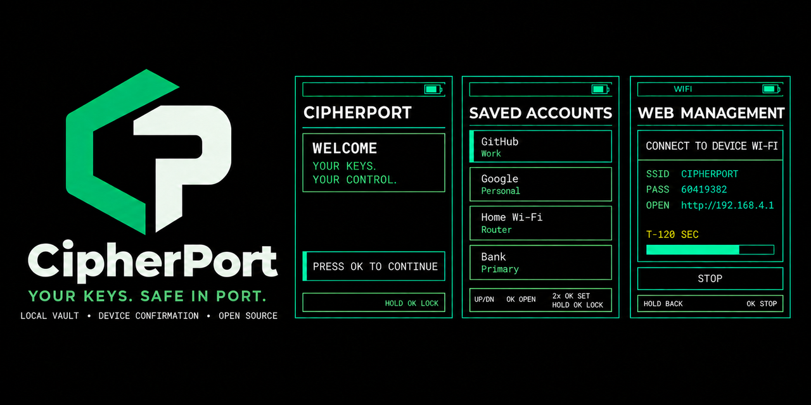

<p align="right">
  <a href="README.zh_CN.md">简体中文</a> · <strong>English</strong>
</p>

# CipherPort

**A local-first password manager for FoloToy AI Passport.**



CipherPort turns the open-source [FoloToy AI Passport](https://github.com/FoloToy/ai-passport) into a pocket-size password vault. Records stay on the device, passwords are hidden until explicitly revealed, and a temporary local Web Manager is available only when the user starts it from the device.

The browser is an editor, not the vault. Opening a session, adding or changing a record, changing the PIN, and clearing data all remain under physical-device control.

## What it does

- Stores up to 16 bounded records with platform, URL, username, password, and note fields.
- Protects access with a fixed four-digit PIN and a one-time eight-digit recovery code.
- Randomizes the on-device digit order after every secret-entry step.
- Locks PIN entry after five failures and permanently disables recovery for the current vault after three failed recovery attempts.
- Requires a second on-device confirmation before revealing a password, then hides it automatically after a configurable 5–30 second window.
- Provides English and Simplified Chinese device interfaces.
- Hosts a dependency-free Web Manager directly from the device, with no cloud service, analytics, remote assets, cookies, or browser storage.

## Local Web Management

Web Management starts only after the vault is unlocked and the user requests it on the device:

1. CipherPort creates the WPA2 network `CIPHERPORT` with a new random eight-digit password.
2. One client joins the network and opens the private address shown on the device.
3. The user presses `OK` on the device to authorize the browser session.
4. Account changes are staged in RAM until the user selects `APPROVE` or `CANCEL` and confirms on the device.
5. Leaving Web Management, locking the vault, or reaching a session timeout stops Wi-Fi and invalidates the in-memory session token.

The browser never asks for the vault PIN or recovery code. Responses are sent with `Cache-Control: no-store` and restrictive security headers.

## Storage and security model

- A random 256-bit vault key encrypts records with AES-256-GCM.
- PIN and recovery verifiers use independent salts; each path wraps the vault key separately.
- Vault writes use two authenticated generations: the inactive generation is written and verified before the active marker changes.
- PIN and recovery attempt counters persist across reset and power loss.
- Sensitive buffers are wiped when leaving reveal, unlock, recovery, Web authorization, lock, and sleep-preparation states.
- The 2 MiB vault partition is separate from the application and from the protected per-device `cardid` region.

CipherPort is development-stage security firmware, not a certified hardware security module. The current local page uses HTTP over the WPA2 link and therefore has no independent application-layer transport encryption. Production deployment also requires an approved Flash Encryption, Secure Boot, NVS encryption, debug, and anti-rollback provisioning policy. See the [complete security boundaries](docs/password-manager/README.md#security-architecture) before storing real credentials.

## Device controls

| Input | Default behavior |
| --- | --- |
| `UP` / `DOWN` | Move through items, choices, or secret-entry digits |
| `OK` click | Confirm, enter, reveal, or execute the selected action |
| `OK` double-click | Open Settings from the account list; delete the previous secret-entry digit where supported |
| `OK` long press | Go back, cancel, lock from supported screens, or hold for a destructive confirmation only when explicitly prompted |

The three buttons share one ADC resistor ladder, so simultaneous `UP+DOWN` gestures are intentionally not used.

## Hardware target

| Item | Current target |
| --- | --- |
| Device | FoloToy AI Passport |
| MCU | ESP32-C3 |
| Flash | 8 MB |
| PSRAM | None |
| Display | 240 x 320 portrait RGB565 |
| Framework | ESP-IDF 5.5.3 + LVGL |
| Input | Three physical buttons: `UP`, `DOWN`, `OK` |

CipherPort does **not** provide cloud sync, USB or Bluetooth password typing, fingerprint unlock, USB networking, or an authenticator in the current release.

## Build and validate

Activate ESP-IDF 5.5.3, then run the repository gate:

```bash
source <path-to-esp-idf-v5.5.3>/export.sh
idf.py --version
./tools/validate.sh --static
./tools/validate.sh --firmware
```

`--firmware` builds and verifies both supported Flash layouts and creates three partition-matched ZIP packages under `build/`. The complete gate is:

```bash
./tools/validate.sh
```

A successful build is not physical-device validation. Display readability, button behavior, power loss during writes, repeated Wi-Fi lifecycle, memory headroom, and the absence of sensitive logs still require on-device testing.

## Flash safely

> [!CAUTION]
> `cardid` is fixed at `0x356000`. Never flash or distribute a contiguous image from `0x0` that crosses this region, and never run `erase-flash` on a provisioned device.

Use the package matching the device partition table:

- `AI-Passport-factory-4m.zip` — segmented factory package for a new device with a blank partition table.
- `AI-Passport-upgrade-legacy-3m.zip` — application-only upgrade at `0x10000` for an existing legacy device.
- `AI-Passport-upgrade-factory-4m.zip` — application-only upgrade at `0x360000` for an already provisioned 4 MB application layout.

The repository flasher checks the device partition table before writing:

```bash
python tools/flash_package.py build/<package>.zip --port <serial-port>
```

Read the [protected Flash layout](docs/development/engineering/protected-flash-layout.md) before flashing. There is no automatic migration between legacy and factory layouts.

## Project map

```text
main/password_manager_app.c    Device UI and interaction flow
main/password_manager_model.c  Testable security and timing state
main/vault_store.c             Authenticated two-generation vault storage
main/web_manager.c             SoftAP, HTTP API, sessions, and approvals
web-manager/                   Browser management interface
tests/                         Host-side state and package checks
tools/                         Validation, packaging, and safe flashing
docs/password-manager/         Product requirements and security boundaries
```

Start with these documents:

- [CipherPort requirements and state model](docs/password-manager/README.md)
- [Web Manager architecture](web-manager/README.md)
- [Build and test guide](docs/development/engineering/build-and-test.md)
- [Protected Flash layout](docs/development/engineering/protected-flash-layout.md)
- [AI Passport hardware capability contract](docs/README.md)
- [Contribution guide](.github/CONTRIBUTING.md)
- [Security policy](.github/SECURITY.md)

## License

This repository is licensed under the [MIT License](LICENSE). CipherPort is built on the open-source FoloToy AI Passport hardware and firmware baseline.
